# LiDAR MLOps Platform

> Cloud-portable geospatial data engineering and MLOps platform for mobile LiDAR building identification — Bronze/Silver/Gold data lake, Airflow orchestration, MLflow experiment tracking, DVC dataset versioning, and 3D deep learning segmentation with downstream risk and exposure analytics.

[](https://github.com/sanskar-sri/lidar-mlops-platform/actions/workflows/ci.yml)


---

## Overview

I build production-grade geospatial data platforms and MLOps pipelines — processing 119.78M+ mobile LiDAR points through a governed Bronze/Silver/Gold lake, orchestrating preprocessing with Airflow on remote GPU workers, tracking experiments with MLflow, versioning datasets with DVC, and delivering 3D building segmentation (92.82% accuracy) with downstream risk and exposure analytics. Industry background in Snowflake medallion warehouses with dbt Core, BigQuery lakehouses, and cloud data pipelines for global enterprise clients.

Raw mobile LiDAR files are large, unstructured, dataset-specific, and not directly usable for machine learning. This platform bridges that gap — turning raw `.ply`, `.las`, and `.laz` survey files into a governed data lake with dataset registration, metadata analytics, preprocessing orchestration, Silver/Gold artifact validation, training handoff, and experiment-tracking integration.

**Target use cases:** urban digital twins · smart-city mapping · building inventory generation · flood and disaster risk exposure · infrastructure asset monitoring · geospatial AI data management · catastrophe modelling input data

---

## Platform Screenshots

**Dashboard — home page with live infrastructure status**


**Data Explorer — dataset analytics workspace showing 78M+ points indexed across 5 datasets**


**Rerun 3D viewer — semantically labelled mobile LiDAR point cloud (street scene)**


---

## Architecture

```mermaid
flowchart LR
    A["Raw LiDAR files\nPLY / LAS / LAZ"] --> B["Bronze layer\nsource files + manifests"]
    B --> C["Dataset registry\nmetadata + Parquet analytics"]
    C --> D["Dash control plane\nupload · explore · trigger · monitor"]
    D --> E["Airflow preprocessing DAG\nremote workstation / GPU worker"]
    E --> F["Silver layer\ncleaned point cloud + stats"]
    F --> G["Gold layer\nmodel-ready blocks + scenes"]
    G --> H["Training workflow\nPointNet++ / RandLA-Net / PTv3"]
    H --> I["MLflow + DVC\nexperiments + versioned outputs"]
    I --> J["Risk & Exposure\nflood scoring · building inventory · GIS export"]
```



---

## Data Lake Layout

Six-zone layout on Backblaze B2 (S3-compatible) — medallion architecture extended for the full ML lifecycle:

```text
Building-Identification-MLS/
│
├── 01_raw_data/
│   └── bronze_raw_data/
│       └── <dataset_id>/
│           ├── source_files/
│           │   ├── tiles/              # raw .ply / .las / .laz point-cloud tiles
│           │   └── label_maps/         # per-tile annotation files
│           └── manifests/              # upload manifests with checksums and file lists
│
├── 02_preprocessing/
│   ├── silver_preprocessed_data/
│   │   └── <dataset_id>/
│   │       └── <prep_version>/         # cleaned point cloud + stats + density grids
│   └── gold_model_ready_data/
│       └── <dataset_id>/
│           └── <prep_version>/         # model-ready blocks (PointNet++ / PTv3 format)
│
├── 03_segmentation/
│   ├── training_runs/
│   │   └── <dataset_id>/<prep_version>/<model_name>/<run_id>/   # checkpoints + configs
│   └── segmentation_outputs/
│       └── <dataset_id>/<prep_version>/<model_name>/<run_id>/   # per-tile predictions
│
├── 04_clustering/
│   └── clustered_final_outputs/
│       └── <dataset_id>/<prep_version>/<model_name>/<run_id>/   # RANSAC + cluster results
│
├── 05_applications/
│   ├── gis_exports/
│   │   └── <dataset_id>/<prep_version>/<model_name>/<run_id>/   # GeoJSON / GeoParquet exports
│   └── risk_exposure/
│       └── <dataset_id>/<run_id>/                               # flood / disaster risk outputs
│
└── 06_governance/
    ├── metadata/
    │   └── datasets/                   # dataset registry JSON files
    ├── metadata_analytics/
    │   └── <dataset_id>/               # Parquet analytics: file summary, label distribution,
    │                                   #   spatial summary, quality checks, density grids, KPIs
    ├── benchmark_results/              # committed model accuracy and IoU reports
    ├── lineage/                        # dataset-to-run lineage records
    ├── qc_reports/                     # automated quality check outputs
    ├── logs/                           # preprocessing and training run logs
    └── rerun_outputs/                  # Rerun SDK 3D visualisation recordings
```

---

## Results

Model benchmarks on mobile LiDAR building segmentation (binary: building / non-building):

| Model | Overall accuracy | Building IoU | Non-building IoU | Notes |
|---|---|---|---|---|
| PointNet++ | **92.82%**  | — | — | Block-based baseline |
| PointNet++ MSG | — | — | — | Multi-scale grouping |
| RandLA-Net | — | — | — | Large-scale efficient baseline |
| **PTv3** | —| — | — | Best performing architecture |

> Full per-class metrics and dataset-level benchmark reports are committed under `06_governance/benchmark_results/`.

---

## Risk & Exposure Analytics

The platform computes downstream risk metrics from LiDAR-derived building detection outputs — directly applicable to catastrophe modelling, property exposure management, and insurance analytics workflows:

- **Flood depth exposure scoring** — per-building flood risk classification from LiDAR-derived elevation and detection confidence, suitable for integration with regulated flood zone datasets
- **Building height classification** — low / mid / high-rise categorisation from Z-axis point density in detected building clusters
- **Detection confidence scoring** — model confidence per detected building cluster for exposure data quality filtering and auditability
- **Building inventory pipeline** — end-to-end workflow from raw LiDAR scan to structured building inventory with spatial attributes, class labels, and confidence scores
- **GIS export** — GeoJSON and GeoParquet outputs for spatial join against external hazard zone datasets (flood plains, seismic zones, OSM infrastructure proximity)

This module maps directly to exposure data engineering workflows at catastrophe modelling firms (RMS, AIR, Verisk), re/insurance companies (Swiss Re, Moody's, CoreLogic), and location intelligence platforms (HERE, Precisely, Esri).

---

## Platform Workflow

```
1.  Upload raw .ply / .las / .laz files and label maps
2.  Validate file integrity with checksums and upload manifests
3.  Generate dataset metadata, spatial summaries, class mappings, and quality checks
4.  Explore datasets through the Dash dashboard and Parquet analytics panels
5.  Trigger preprocessing via Airflow using a minimal run configuration
6.  Poll Airflow for DAG state, task progress, and failure detail
7.  Verify Silver outputs: cleaned point cloud, stats, density grids
8.  Unlock Gold model-ready outputs when the dataset contract is validated
9.  Monitor training jobs and connect outputs to MLflow / DVC workflows
10. Run RANSAC clustering on segmentation outputs for building candidate generation
11. Export GIS outputs and compute risk exposure metrics
```

---

## Dashboard Pages

| Page | Route | Purpose |
|---|---|---|
| Home | `/` | Platform overview and live infrastructure health |
| Data Explorer | `/data-explorer` | Upload raw LiDAR data, browse datasets, inspect Parquet analytics |
| Preprocessing | `/preprocessing` | Configure, trigger, and monitor Airflow preprocessing runs |
| Silver / Gold Outputs | `/silver-gold-outputs` | Validate preprocessing artifacts and dataset contracts |
| Training | `/training` | Monitor model training workflows |
| Inference Outputs | `/inference-outputs` | Review segmentation and clustering results |
| Postprocessing | `/postprocessing` | Downstream model output review |
| GIS Exports | `/gis-exports` | Browse and download GIS-ready outputs |
| Risk Exposure | `/risk-exposure` | Flood depth, building height, and detection confidence scoring |
| Model Benchmark | `/model-benchmark` | Accuracy, IoU, and latency comparisons across model runs |
| Lineage & Governance | `/lineage-governance` | Dataset lineage, quality checks, and audit records |
| Dataset Readiness | `/dataset-readiness` | Gold contract validation before training handoff |
| Monitoring & Cost | `/monitoring-cost` | Storage growth, processing cost, and pipeline health KPIs |
| Control Panel | `/control-panel` | Compute node status, service health, and runtime checks |
| API Integration | `/api-integration` | External system connections and integration status |

---

## Airflow DAGs

| DAG | Trigger | Purpose |
|---|---|---|
| `lidar_preprocessing_pipeline` | Manual | Full preprocessing run on the remote GPU workstation |
| `lidar_training_pipeline` | Manual | Model training against Gold model-ready data |
| `dag_health_b2` | Scheduled | B2 reachability and bucket prefix health check |
| `dag_health_remote` | Scheduled | MLflow, GPU, OS, and runtime health on the workstation |

The Dash controller sends only `{dataset_id, mode, run_id}` to Airflow — pipeline defaults live on the workstation side. Full audit payloads are persisted locally under `data/airflow_preprocessing_requests/`.

---

## Model-Ready Dataset Support

| Model family | Data format prepared |
|---|---|
| PointNet++ | Block-based HDF5 with point subsampling and local neighbourhood labels |
| PointNet++ MSG | Multi-scale blocks with variable radius grouping inputs |
| RandLA-Net | Large-scale scenes with KNN graph precomputation |
| PTv3 / Pointcept | Scene-level serialised format for transformer-based 3D segmentation |

---

## Technical Stack

| Area | Technologies |
|---|---|
| Application & UI | Python, Dash, Dash Bootstrap Components, Plotly |
| Point-cloud I/O | Open3D, plyfile, laspy, lazrs |
| Geospatial | GeoPandas, Shapely, pyproj, GeoParquet |
| Analytics | Pandas, PyArrow, Parquet |
| Object storage | Backblaze B2 — S3-compatible via b2sdk + boto3 |
| Orchestration | Apache Airflow |
| Experiment tracking | MLflow |
| Dataset versioning | DVC |
| 3D visualisation | Rerun SDK |
| Deep learning | PyTorch, PointNet++, RandLA-Net, PTv3 |
| Post-processing | RANSAC clustering, scikit-learn |
| CI | GitHub Actions, ruff |
| Deployment | Docker, Docker Compose |

---

## Repository Structure

```text
.
├── app.py                               # Dash app entrypoint
├── pages/                               # Dashboard page modules (one per route)
├── components/                          # Reusable UI cards and layout sections
├── services/                            # B2, metadata, Airflow, MLflow, training,
│                                        #   risk, GIS, lineage, benchmark services
├── airflow_dags/
│   └── dags/
│       ├── dag_health_b2.py
│       └── dag_health_remote.py
├── scripts/
│   └── compute_node_health_agent.py     # Windows workstation health agent
├── tests/                               # Unit tests (pytest)
├── .github/
│   └── workflows/
│       └── ci.yml                       # Lint and import checks on push
├── assets/                              # CSS and browser-upload JavaScript
├── data/
│   ├── metadata/                        # Local dataset registry cache
│   └── metadata_analytics/             # Local Parquet analytics cache
├── Dockerfile
├── docker-compose.yml
└── requirements.txt
```

---

## Local Setup

```bash
# 1. Clone and create environment
git clone https://github.com/sanskar-sri/lidar-mlops-platform.git
cd lidar-mlops-platform
python3 -m venv .venv
source .venv/bin/activate        # Windows: .venv\Scripts\activate
pip install -r requirements.txt

# 2. Configure environment
cp .env.example .env
# Fill in B2, Airflow, and MLflow credentials (see Environment Variables below)

# 3. Run with Docker
docker compose up --build
```

Default local services:

| Service | URL |
|---|---|
| Dash app | `http://localhost:8051` |
| MLflow | `http://localhost:5001` |

---

## Environment Variables

```env
B2_KEY_ID=
B2_APPLICATION_KEY=
B2_BUCKET_NAME=

AIRFLOW_API_BASE_URL=
AIRFLOW_USERNAME=
AIRFLOW_PASSWORD=

MLFLOW_TRACKING_URI=
MLFLOW_PUBLIC_URL=

SYSTEM_1_HEALTH_URL=
SYSTEM_1_AIRFLOW_QUEUE=
```

---

## Key Design Decisions

**No heavy compute in the controller**
The Dash app triggers Airflow and reads artifacts. All preprocessing and model training runs on a remote GPU workstation. The controller never imports point-cloud or deep learning libraries in the request path.

**Minimal Airflow conf**
The controller sends only `{dataset_id, mode, run_id}` to Airflow. Pipeline defaults, paths, and hyperparameters live on the workstation side. Full audit payloads are persisted locally before the DAG is triggered — giving both a reproducible run record and a clean separation between orchestration and configuration.

**Lazy service imports**
All heavy dependencies (b2sdk, pandas, numpy, plyfile, laspy, pyarrow, open3d) are imported inside function bodies, not at module level. This keeps Dash app startup under 3 seconds regardless of which libraries are installed, and lets the dashboard load before any cloud or model libraries initialise.

**B2 as the single source of truth**
Silver and Gold artifacts are always read from B2 after DAG completion — not from local disk. This ensures the dashboard, training environment, and risk module all share the same data layer, eliminating drift between local cache and remote outputs.

**S3-portable lake design**
The bucket layout and all service code use S3-compatible semantics via boto3. Switching from Backblaze B2 to AWS S3 or GCS requires only environment variable changes — no code changes. This makes the architecture directly portable to enterprise AWS or GCP deployments.

---

## Roadmap

- [ ] Complete per-class IoU benchmark table with all four model architectures
- [ ] GIS export support for CityJSON and 3D Tiles formats
- [ ] Model comparison dashboard with accuracy, IoU, latency, and confidence summaries
- [ ] Fire spread risk scoring from inter-building distance and roof type classification
- [ ] External hazard overlays via OSM Overpass API and open flood-zone datasets (TRCA, PPRI Nord)
- [ ] Earthquake exposure module — building height category joined against USGS / BRGM seismic hazard zones
- [ ] CI expansion — service import checks, page registration validation, metadata schema tests
- [ ] Cloud reference architecture with cost-aware AWS / GCP deployment guide

---

## Research & Acknowledgements

Developed as an M.Tech thesis project at **MNNIT Prayagraj** (Department of Geoinformatics).

Presented at **SPARC 2026 International Conference, IIT Kanpur** — *Self-Supervised Learning for Near-Miss Pedestrian Risk Detection* — an internationally collaborative research programme supported by the Ministry of Education, Government of India.

---

## License

MIT
