# LiDAR Data Platform

An end-to-end geospatial data engineering and MLOps platform for managing mobile LiDAR point clouds, preparing model-ready datasets, and orchestrating building / non-building segmentation workflows.

This project is built around a practical smart-city problem: raw LiDAR files are large, unstructured, difficult to inspect, and not directly ready for machine learning. The platform turns those files into a governed data lake workflow with dataset registration, metadata analytics, preprocessing orchestration, Silver / Gold artifact validation, training handoff, and experiment-tracking integration.

## What This Project Demonstrates

- Cloud-portable LiDAR data lake design using Bronze, Silver, and Gold layers
- Raw `.ply`, `.las`, and `.laz` point-cloud intake with checksum and manifest tracking
- Dataset registry generation with metadata, label summaries, spatial summaries, and quality checks
- Dash-based operations UI for data upload, dataset exploration, preprocessing control, training monitoring, and compute health
- Airflow-triggered preprocessing pipelines for remote workstation / GPU-worker execution
- Model-ready dataset generation for PointNet++ / PointNet++ MSG / RandLA-Net style blocks and Pointcept / PTv3 style scenes
- MLflow and DVC integration points for reproducible machine learning workflows
- 3D visualization support for inspecting point-cloud data before and after processing

## Business Problem

Cities, infrastructure teams, and geospatial companies increasingly use LiDAR and 3D mapping to build digital twins, monitor assets, assess disaster exposure, and support urban planning. A segmentation model alone is not enough for this workflow. Real teams need a platform that can ingest raw survey data, track where it came from, validate it, preprocess it consistently, and produce model-ready datasets that can be reproduced later.

This platform supports use cases such as:

- Urban digital twin preparation
- Smart-city mapping and 3D city model enrichment
- Building inventory generation
- Road and infrastructure asset monitoring
- Flood exposure and disaster-risk analysis
- Urban planning and development control
- Geospatial AI-ready data management
- Automated LiDAR-based building identification

## Why a Data Platform Is Needed

Raw LiDAR data is not directly usable for production machine learning. A real workflow has to solve several engineering problems before model training starts:

- Point-cloud files can be very large and expensive to move repeatedly
- Raw `.ply`, `.las`, and `.laz` files have dataset-specific schemas, labels, and attributes
- Metadata, lineage, checksums, and quality checks are required for trust and repeatability
- Model training needs consistent blocks, splits, feature channels, labels, and dataset contracts
- Operators need 3D visualization before and after preprocessing
- Long-running preprocessing should be orchestrated outside the UI by Airflow or a worker system
- Experiments and datasets should be tracked through MLflow and DVC

The project is therefore positioned as a geospatial data engineering and MLOps platform, not only as a deep learning model repository.

## Architecture

```mermaid
flowchart LR
    A["Raw LiDAR files<br/>PLY / LAS / LAZ"] --> B["Bronze layer<br/>source files + manifests"]
    B --> C["Dataset registry<br/>metadata + analytics"]
    C --> D["Dash control plane<br/>upload, explore, trigger, monitor"]
    D --> E["Airflow preprocessing DAG<br/>remote workstation / GPU worker"]
    E --> F["Silver layer<br/>cleaned point cloud + stats"]
    F --> G["Gold layer<br/>model-ready blocks + scenes"]
    G --> H["Training workflow<br/>PointNet++ / RandLA-Net / PTv3-ready data"]
    H --> I["MLflow + DVC<br/>experiments + versioned outputs"]
```



## Data Lake Layout

```text
object-storage-bucket/
├── bronze_raw_data/<dataset_id>/
│   ├── source_files/tiles/
│   ├── source_files/label_maps/
│   └── manifests/
├── metadata/datasets/<dataset_id>.json
├── metadata_analytics/<dataset_id>/
│   ├── file_summary.parquet
│   ├── attribute_summary.parquet
│   ├── label_distribution.parquet
│   ├── class_label_distribution.parquet
│   ├── spatial_summary.parquet
│   ├── dashboard_kpis.parquet
│   ├── quality_checks.parquet
│   ├── class_mapping.parquet
│   └── class_mapping_summary.parquet
├── silver_preprocessed_data/<dataset_id>/<prep_version>/
│   ├── analytics/
│   │   ├── processed_cloud_meta.json
│   │   ├── silver_stats.json
│   │   └── silver_density_grid.parquet
│   └── processed point-cloud artifacts
├── gold_model_ready_data/<dataset_id>/<prep_version>/
│   ├── training/ptv3/
│   ├── training/traditional/blocks/
│   ├── artifacts/meta/
│   └── artifacts/eval/
└── logs/<dataset_id>/<run_id>/
```

## Platform Workflow

1. Upload raw point-cloud files and label maps.
2. Verify file integrity with checksums and upload manifests.
3. Generate dataset metadata, spatial summaries, class mappings, and quality checks.
4. Explore datasets through the dashboard and analytics panels.
5. Trigger preprocessing through Airflow using a minimal run configuration.
6. Poll Airflow for DAG state, task progress, and failure detail.
7. Verify Silver outputs after preprocessing completes.
8. Unlock Gold model-ready outputs when the dataset contract is available.
9. Monitor training jobs and connect outputs to MLflow / DVC workflows.

## Main Application Pages

| Page | Path | Purpose |
|---|---|---|
| Home | `/` | Platform overview and service health |
| Data Explorer | `/data-explorer` | Upload raw LiDAR data, browse registered datasets, and inspect analytics |
| Preprocessing | `/preprocessing` | Configure and trigger Airflow preprocessing runs |
| Training | `/training` | Monitor model training workflows |
| Postprocessing | `/postprocessing` | Review downstream model outputs |
| Control Panel | `/control-panel` | Check compute nodes, service status, and runtime health |

## Preprocessing Control Flow

```text
User clicks Start Preprocessing
  -> handle_preprocessing_action()
  -> save full local audit payload under data/airflow_preprocessing_requests/
  -> build minimal Airflow conf: {dataset_id, mode, run_id}
  -> POST /api/v1/dags/lidar_preprocessing_pipeline/dagRuns
  -> store dag_id, dag_run_id, state, b2_silver_prefix, prep_version
  -> poll Airflow DAG/task status every few seconds
  -> verify Silver outputs from B2 after successful DAG completion
  -> render Silver analytics and Gold output readiness
```

The Dash controller does not run heavy preprocessing locally. It creates payloads, triggers Airflow, polls status, and reads generated artifacts from object storage or local cache.

## Airflow DAGs

| DAG | Schedule | Purpose |
|---|---|---|
| `lidar_preprocessing_pipeline` | Triggered manually | Runs preprocessing on the remote worker environment |
| `lidar_training_pipeline` | Triggered manually | Runs model training against Gold model-ready data |
| `dag_health_b2` | Scheduled | B2 reachability and prefix listing check |
| `dag_health_remote` | Scheduled | MLflow, DVC, GPU, OS, and runtime health check |

## Technical Stack

| Area | Technologies |
|---|---|
| UI and application | Python, Dash, Dash Bootstrap Components, Plotly |
| Point-cloud processing support | Open3D, plyfile, laspy, lazrs |
| Analytics storage | Pandas, PyArrow, Parquet |
| Object storage | Backblaze B2 / S3-compatible storage patterns |
| Orchestration | Apache Airflow |
| Experiment tracking | MLflow |
| Dataset versioning | DVC |
| Visualization | Rerun SDK |
| Deployment | Docker, Docker Compose, environment-based configuration |

## Model-Ready Dataset Support

The platform is designed to prepare LiDAR data for multiple 3D segmentation architectures:

| Model family | Purpose |
|---|---|
| PointNet++ | Hierarchical point-based baseline |
| PointNet++ MSG | Multi-scale grouping baseline for local geometric variation |
| RandLA-Net | Efficient large-scale point-cloud segmentation baseline |
| Point Transformer / Pointcept-style data | Advanced transformer-ready scene format |

This makes the platform useful for benchmarking both classical point-based segmentation models and modern transformer-style 3D segmentation workflows.

## Repository Structure

```text
.
├── app.py                         # Dash app entrypoint
├── pages/                         # Dashboard pages
├── components/                    # Reusable UI sections and cards
├── services/                      # B2, metadata, Airflow, MLflow, training, and visualization services
├── airflow_dags/                  # Health-check DAGs and Airflow deployment notes
├── scripts/                       # Compute-node health agent utilities
├── assets/                        # Styling and browser-upload JavaScript
├── data/metadata/                 # Local dataset registry cache
├── data/metadata_analytics/       # Local analytics Parquet cache
├── Dockerfile
├── docker-compose.yml
└── requirements.txt
```

## Local Development

```bash
python3 -m venv .venvvv
source .venvvv/bin/activate
pip install -r requirements.txt

cp .env.example .env
docker compose up --build
```

Default local services:

| Service | URL |
|---|---|
| Dash app | `http://localhost:8051` |
| MLflow | `http://localhost:5001` |

## Required Configuration

Create a `.env` file from `.env.example` and provide environment-specific values:

```text
B2_KEY_ID=
B2_APPLICATION_KEY=
B2_BUCKET_NAME=
AIRFLOW_API_BASE_URL=
AIRFLOW_USERNAME=
AIRFLOW_PASSWORD=
MLFLOW_TRACKING_URI=
MLFLOW_PUBLIC_URL=
SYSTEM_1_HEALTH_URL=
SYSTEM_1_AIRFLOW_QUEUE=
```

Private machine names, workstation IPs, credentials, and local filesystem paths should stay outside the public README and be managed through `.env`, deployment notes, or private runbooks.

## Windows Workstation Runtime Checks

When the Dash controller uses a Windows workstation as the Airflow/runtime host, verify these services from the controller machine:

```bash
curl -s "$AIRFLOW_API_BASE_URL/health"
curl -s "$MLFLOW_PUBLIC_URL/health"
curl -s "$SYSTEM_1_HEALTH_URL"
```

Expected behavior:

- Airflow returns healthy metadatabase and scheduler status.
- MLflow returns a healthy response from its tracking server endpoint.
- The compute health agent returns JSON with `status`, `node_id`, `airflow_queue`, runtime details, and optional GPU metrics.

If Airflow and MLflow are reachable but the compute node is offline, restart the workstation health agent and confirm the configured health-agent port is listening and allowed through the workstation firewall.

## Public Portfolio Highlights

This repository is useful as a portfolio project because it shows more than model training:

- Data engineering: governed object-storage layout, metadata registry, Parquet analytics, checksums, and lineage
- MLOps: Airflow orchestration, MLflow tracking hooks, DVC versioning hooks, reproducible run payloads
- Geospatial AI: LiDAR ingestion, point-cloud analytics, Silver / Gold data contracts, 3D visualization
- Platform engineering: service-based Dash architecture, remote worker integration, health checks, runtime monitoring
- Product thinking: dashboard pages for operators, dataset readiness, preprocessing status, and model workflow monitoring

## Current Scope

This repository contains the data-platform and control-plane layer. It integrates with companion preprocessing and training workflows that run heavier GPU workloads outside the dashboard process.

Large raw LiDAR files, generated Silver / Gold artifacts, model checkpoints, and private credentials should not be committed to the repository.

## Key Bugs Fixed

| Bug | Root cause | Fix |
|---|---|---|
| Preprocessing page could return HTTP 500 during early callback initialization | Preview callbacks fired before all tab inputs were initialized | Added callback guards and delayed preview initialization |
| Verify section used stale UI state if users edited fields after trigger | DAG run store did not carry output prefix/version details | Store run-specific `b2_silver_prefix` and `prep_version` at trigger time |
| Airflow trigger sent an overly broad controller payload | Remote workstation owns pipeline defaults | Send minimal conf to Airflow while persisting the full controller audit payload locally |
| Silver readers missed current DAG output layout | Current DAG writes key Silver analytics into an `analytics/` subfolder | Silver metadata loaders now try `analytics/` first and retain flat-path fallback |

## Roadmap

- Add a public benchmark report with committed model metrics and dataset summaries
- Add CI checks for service imports, page registration, and metadata parsing
- Add business KPI dashboard for dataset readiness, processing cost, and storage growth
- Add GIS export support for GeoJSON, GeoParquet, CityJSON, and 3D Tiles
- Add model comparison dashboard with accuracy, IoU, latency, and confidence summaries
- Add failure diagnostics for preprocessing runs
- Add cloud reference architecture with cost-aware AWS / GCP deployment options
