# LiDAR Data Platform

> An end-to-end geospatial data engineering and MLOps platform for managing mobile LiDAR point clouds, preparing model-ready datasets, and orchestrating 3D building segmentation workflows.


---

## Overview

Raw mobile LiDAR files are large, unstructured, dataset-specific, and not directly usable for machine learning. A segmentation model alone is not enough for a real geospatial AI workflow.

This platform bridges that gap. It turns raw `.ply`, `.las`, and `.laz` survey files into a governed data lake with dataset registration, metadata analytics, preprocessing orchestration, Silver / Gold artifact validation, training handoff, and experiment-tracking integration — across a Bronze → Silver → Gold pipeline on Backblaze B2 object storage.

**Target use cases:** urban digital twins · smart-city mapping · building inventory generation · flood and disaster risk exposure · infrastructure asset monitoring · geospatial AI data management.

---

## Architecture

```mermaid
flowchart LR
    A["Raw LiDAR files\nPLY / LAS / LAZ"] --> B["Bronze layer\nsource files + manifests"]
    B --> C["Dataset registry\nmetadata + analytics"]
    C --> D["Dash control plane\nupload · explore · trigger · monitor"]
    D --> E["Airflow preprocessing DAG\nremote workstation / GPU worker"]
    E --> F["Silver layer\ncleaned point cloud + stats"]
    F --> G["Gold layer\nmodel-ready blocks + scenes"]
    G --> H["Training workflow\nPointNet++ / RandLA-Net / PTv3"]
    H --> I["MLflow + DVC\nexperiments + versioned outputs"]
```



---

## Data Lake Layout

The platform uses a six-zone layout on Backblaze B2, mirroring a medallion architecture extended for the full ML lifecycle:

```text
Building-Identification-MLS/
│
├── 01_raw_data/
│   └── bronze_raw_data/
│       └── <dataset_id>/
│           ├── source_files/
│           │   ├── tiles/              # raw .ply / .las / .laz point-cloud tiles
│           │   └── label_maps/         # per-tile annotation files
│           └── manifests/              # upload manifests with checksums and file lists
│
├── 02_preprocessing/
│   ├── silver_preprocessed_data/
│   │   └── <dataset_id>/
│   │       └── <prep_version>/         # cleaned point cloud + stats + density grids
│   └── gold_model_ready_data/
│       └── <dataset_id>/
│           └── <prep_version>/         # model-ready blocks (PointNet++ / PTv3 format)
│
├── 03_segmentation/
│   ├── training_runs/
│   │   └── <dataset_id>/<prep_version>/<model_name>/<run_id>/   # checkpoints + configs
│   └── segmentation_outputs/
│       └── <dataset_id>/<prep_version>/<model_name>/<run_id>/   # per-tile predictions
│
├── 04_clustering/
│   └── clustered_final_outputs/
│       └── <dataset_id>/<prep_version>/<model_name>/<run_id>/   # RANSAC + cluster results
│
├── 05_applications/
│   ├── gis_exports/
│   │   └── <dataset_id>/<prep_version>/<model_name>/<run_id>/   # GeoJSON / GeoParquet exports
│   └── risk_exposure/
│       └── <dataset_id>/<run_id>/                               # flood / disaster risk outputs
│
└── 06_governance/
    ├── metadata/
    │   └── datasets/                   # dataset registry JSON files
    ├── metadata_analytics/
    │   └── <dataset_id>/               # Parquet analytics (file summary, label distribution,
    │                                   #   spatial summary, quality checks, KPIs)
    ├── benchmark_results/              # committed model accuracy and IoU reports
    ├── lineage/                        # dataset-to-run lineage records
    ├── qc_reports/                     # automated quality check outputs
    ├── logs/                           # preprocessing and training run logs
    └── rerun_outputs/                  # Rerun SDK 3D visualisation recordings
```

---

## Platform Workflow

```
1. Upload raw .ply / .las / .laz files and label maps
2. Validate file integrity with checksums and upload manifests
3. Generate dataset metadata, spatial summaries, class mappings, and quality checks
4. Explore datasets through the Dash dashboard and analytics panels
5. Trigger preprocessing via Airflow using a minimal run configuration
6. Poll Airflow for DAG state, task progress, and failure detail
7. Verify Silver outputs: cleaned point cloud, stats, density grids
8. Unlock Gold model-ready outputs when the dataset contract is validated
9. Monitor training jobs and connect outputs to MLflow / DVC workflows
10. Export GIS outputs and run risk exposure analysis
```

---

## Dashboard Pages

| Page | Route | Purpose |
|---|---|---|
| Home | `/` | Platform overview and service health |
| Data Explorer | `/data-explorer` | Upload raw LiDAR data, browse datasets, inspect analytics |
| Preprocessing | `/preprocessing` | Configure, trigger, and monitor Airflow preprocessing runs |
| Silver / Gold Outputs | `/silver-gold-outputs` | Validate preprocessing artifacts and dataset contracts |
| Training | `/training` | Monitor model training workflows |
| Inference Outputs | `/inference-outputs` | Review segmentation and clustering results |
| Postprocessing | `/postprocessing` | Downstream model output review |
| GIS Exports | `/gis-exports` | Browse and download GIS-ready outputs |
| Risk Exposure | `/risk-exposure` | Flood depth, building height, and detection confidence scoring |
| Model Benchmark | `/model-benchmark` | Accuracy, IoU, and latency comparisons across model runs |
| Lineage & Governance | `/lineage-governance` | Dataset lineage, quality checks, and audit records |
| Dataset Readiness | `/dataset-readiness` | Gold contract validation before training handoff |
| Monitoring & Cost | `/monitoring-cost` | Storage growth, processing cost, and pipeline health KPIs |
| Control Panel | `/control-panel` | Compute node status, service health, and runtime checks |
| API Integration | `/api-integration` | External system connections and integration status |

---

## Airflow DAGs

| DAG | Trigger | Purpose |
|---|---|---|
| `lidar_preprocessing_pipeline` | Manual | Preprocessing on the remote GPU workstation |
| `lidar_training_pipeline` | Manual | Model training against Gold model-ready data |
| `dag_health_b2` | Scheduled | B2 reachability and bucket prefix health check |
| `dag_health_remote` | Scheduled | MLflow, GPU, OS, and runtime health on the workstation |

The Dash controller does not run heavy preprocessing locally. It builds a minimal Airflow `conf` payload (`dataset_id`, `mode`, `run_id`), triggers the DAG via the Airflow REST API, polls task state, and reads generated artifacts from B2 or local cache.

---

## Model-Ready Dataset Support

| Model family | Data format prepared |
|---|---|
| PointNet++ | Block-based HDF5 with point subsampling and local neighbourhood labels |
| PointNet++ MSG | Multi-scale blocks with variable radius grouping inputs |
| RandLA-Net | Large-scale scenes with KNN graph precomputation |
| PTv3 / Pointcept | Scene-level serialised format for transformer-based 3D segmentation |

---

## Technical Stack

| Area | Technologies |
|---|---|
| Application & UI | Python, Dash, Dash Bootstrap Components, Plotly |
| Point-cloud I/O | Open3D, plyfile, laspy, lazrs |
| Geospatial | GeoPandas, Shapely, pyproj |
| Analytics | Pandas, PyArrow, Parquet |
| Object storage | Backblaze B2 (S3-compatible via b2sdk + boto3) |
| Orchestration | Apache Airflow |
| Experiment tracking | MLflow |
| Dataset versioning | DVC |
| 3D visualisation | Rerun SDK |
| Machine learning | scikit-learn, PyTorch (training environment) |
| Deployment | Docker, Docker Compose |

---

## Repository Structure

```text
.
├── app.py                          # Dash app entrypoint
├── pages/                          # Dashboard page modules (one per route)
├── components/                     # Reusable UI cards and layout sections
├── services/                       # B2, metadata, Airflow, MLflow, training, risk, GIS services
├── airflow_dags/                   # Health-check DAGs and Airflow deployment notes
│   └── dags/
│       ├── dag_health_b2.py
│       └── dag_health_remote.py
├── scripts/
│   └── compute_node_health_agent.py   # Windows workstation health agent
├── assets/                         # CSS and browser-upload JavaScript
├── data/
│   ├── metadata/                   # Local dataset registry cache
│   └── metadata_analytics/         # Local Parquet analytics cache
├── Dockerfile
├── docker-compose.yml
└── requirements.txt
```

---

## Local Setup

```bash
# 1. Clone and create environment
git clone https://github.com/<your-username>/data-platform.git
cd data-platform
python3 -m venv .venv
source .venv/bin/activate
pip install -r requirements.txt

# 2. Configure environment
cp .env.example .env
# Fill in B2, Airflow, and MLflow credentials

# 3. Run with Docker
docker compose up --build
```

Default local services:

| Service | URL |
|---|---|
| Dash app | `http://localhost:8051` |
| MLflow | `http://localhost:5001` |

---

## Environment Variables

Create a `.env` file with the following keys:

```env
B2_KEY_ID=
B2_APPLICATION_KEY=
B2_BUCKET_NAME=

AIRFLOW_API_BASE_URL=
AIRFLOW_USERNAME=
AIRFLOW_PASSWORD=

MLFLOW_TRACKING_URI=
MLFLOW_PUBLIC_URL=

SYSTEM_1_HEALTH_URL=
SYSTEM_1_AIRFLOW_QUEUE=
```

---

## Key Design Decisions

- **No heavy compute in the controller** — the Dash app triggers Airflow and reads artifacts; all preprocessing and training runs on a remote GPU workstation.
- **Minimal Airflow conf** — the controller sends only `{dataset_id, mode, run_id}` to Airflow; pipeline defaults live on the workstation side. Full audit payloads are persisted locally under `data/airflow_preprocessing_requests/`.
- **Lazy service imports** — all heavy dependencies are imported inside function bodies, keeping app startup fast and allowing the dashboard to load before any model or cloud libraries initialise.
- **B2 as the single source of truth** — Silver and Gold artifacts are read from B2 after DAG completion, not from local disk, ensuring the dashboard and training environment share the same data layer.

---

## Roadmap

- [ ] Public benchmark report with committed model metrics, dataset summaries, and per-class IoU
- [ ] GIS export support for CityJSON and 3D Tiles formats
- [ ] Model comparison dashboard with accuracy, IoU, latency, and confidence summaries
- [ ] Fire spread risk scoring from inter-building distance and roof type classification
- [ ] External hazard overlays via OSM Overpass API and open flood-zone datasets
- [ ] CI checks for service imports, page registration, and metadata schema validation
- [ ] Cloud reference architecture with cost-aware AWS / GCP deployment notes

---

## Research & Acknowledgements

This platform was developed as an M.Tech thesis project at **MNNIT Prayagraj** (Department of Geoinformatics).

Findings were presented at **SPARC 2026, IIT Kanpur** — an internationally collaborative research programme supported by the Ministry of Education, Government of India.

---

## License

MIT
